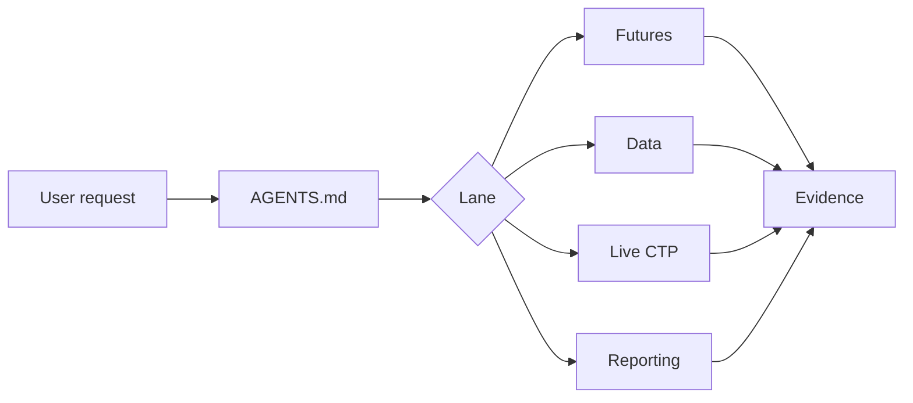

# SSQuant Agent

[&#x7B80;&#x4F53;&#x4E2D;&#x6587;](README.md) | **English**


> SSQuant Agent is a futures-focused workflow agent for SSQuant strategy development, data_server diagnostics, CTP/SIMNOW gates, and Chinese backtest reporting.


## About The Upstream SSQuant Framework

SSQuant is a Python quantitative trading framework for the Chinese futures market. One strategy codebase can run across **backtesting / SIMNOW simulation / CTP live trading**.

It is not a toy project that only runs historical backtests. SSQuant is designed around practical futures-trading engineering problems: continuous contracts, price adjustment, rollover, margin, commission, slippage, CTP order routing, Tick/K-line data, SIMNOW verification, live runtime, and backtest reports.

| Item | Value |
| --- | --- |
| Current version | v0.4.6 |
| Python | 3.9 - 3.14 |
| Upstream license | MIT |
| GitHub | [songshuquant/ssquant](https://github.com/songshuquant/ssquant) |
| Gitee | [ssquant/ssquant](https://gitee.com/ssquant/ssquant) |
| Website | [quant789.com](https://quant789.com/) |

> The MIT license above refers to the upstream SSQuant framework. This repository is a QUANTSKILLS Agent package and is licensed separately; see [LICENSE](LICENSE).

## What It Covers

| Lane | Purpose |
| --- | --- |
| Futures strategies | Create, repair, explain, and backtest SSQuant futures strategies |
| Data services | Diagnose `data_server`, SQLite/cache, raw/adjusted price semantics, and async history tasks |
| SIMNOW/CTP | Gate runtime migration from backtests to simulated or real CTP environments |
| Reporting | Generate and debug Chinese HTML/Markdown reports, charts, and metrics |

## Why This Is An Agent

This repository is named `agent-ssquant` and declares itself through root `AGENTS.md`.

```text
product name: SSQuant Agent
repo name:    agent-ssquant
entry file:   AGENTS.md
compat skill: skills/ssquant/SKILL.md
```

`skills/ssquant/SKILL.md` is only a compatibility bridge for local runtimes that still discover capabilities through `SKILL.md`.



## Install

Clone the public agent repository:

```powershell
gh repo clone quantskills/agent-ssquant
```

For local platforms that only load skills, install the compatibility entry from `skills/ssquant/SKILL.md` together with the repository references and scripts.

## Example Prompts

```text
Use SSQuant Agent to diagnose why this futures strategy has no trades.
Use SSQuant Agent to check raw versus adjust_type=1 behavior from data_server.
Use SSQuant Agent to run a real 60m dual moving average backtest and produce a Chinese report.
Use SSQuant Agent to gate a SIMNOW strategy before CTP runtime.
```

## Evidence Standard

The agent should not claim success without concrete evidence: command output, report paths, logs, SQL/API results, or rendered artifacts.

## License

This QUANTSKILLS Agent package is licensed under the GNU General Public License v3.0. See [LICENSE](LICENSE). The upstream SSQuant framework is distributed under the MIT License.
