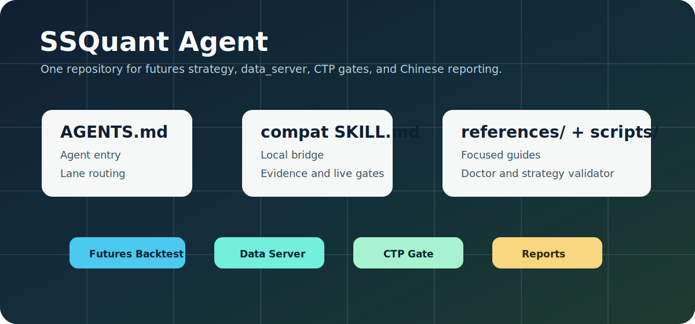
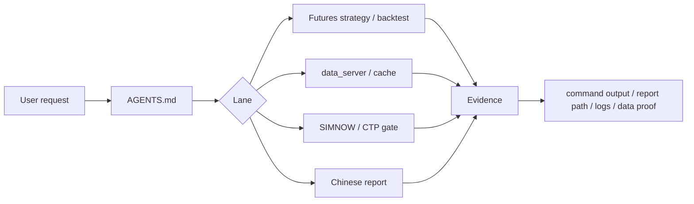

# SSQuant Agent

**&#x7B80;&#x4F53;&#x4E2D;&#x6587;** | [English](README.en.md)


> **&#x5F53;&#x524D;&#x7248;&#x672C;**: SSQuant Agent &#x9762;&#x5411; **&#x671F;&#x8D27;&#x7B56;&#x7565; / data_server / SIMNOW/CTP / &#x4E2D;&#x6587;&#x56DE;&#x6D4B;&#x62A5;&#x544A;** &#x5DE5;&#x4F5C;&#x6D41;&#x3002;



## SSQuant - 专业期货 CTP 量化交易框架

SSQuant（松鼠Quant）是面向中国期货市场的 Python 量化交易框架，支持一套策略代码在 **回测 / SIMNOW 仿真 / CTP 实盘** 三种环境中运行。

它不是只做历史回测的 toy project，而是围绕期货交易的真实工程问题设计：连续合约、复权、换月、保证金、手续费、滑点、CTP 下单、Tick/K 线数据、SIMNOW 验证、实盘运行和回测报告。

| 项目 | 信息 |
| --- | --- |
| 当前版本 | v0.4.6 |
| Python | 3.9 - 3.14 |
| 上游 License | MIT |
| GitHub | [songshuquant/ssquant](https://github.com/songshuquant/ssquant) |
| Gitee | [ssquant/ssquant](https://gitee.com/ssquant/ssquant) |
| 官网 | [quant789.com](https://quant789.com/) |

> 这里的 MIT License 指 SSQuant 上游框架；本仓库是 QUANTSKILLS Agent 包，许可证以本仓库 [LICENSE](LICENSE) 为准。

## &#x8FD9;&#x662F;&#x4EC0;&#x4E48;

SSQuant Agent &#x662F;&#x7ED9; AI &#x7F16;&#x7801;&#x4EE3;&#x7406;&#x4F7F;&#x7528;&#x7684; SSQuant &#x671F;&#x8D27;&#x5DE5;&#x4F5C;&#x6D41;&#x5951;&#x7EA6;&#x3002;&#x5B83;&#x4E0D;&#x662F;&#x4E00;&#x5806;&#x7B56;&#x7565;&#x6A21;&#x677F;&#xFF0C;&#x800C;&#x662F;&#x8BA9;&#x4EE3;&#x7406;&#x5728;&#x771F;&#x5B9E;&#x9879;&#x76EE;&#x91CC;&#x6309;&#x6B63;&#x786E;&#x987A;&#x5E8F;&#x505A;&#x4E8B;&#xFF1A;&#x5148;&#x770B;&#x6E90;&#x7801;&#x548C;&#x793A;&#x4F8B;&#xFF0C;&#x518D;&#x5199;&#x7B56;&#x7565;&#xFF0C;&#x518D;&#x8DD1;&#x771F;&#x5B9E;&#x56DE;&#x6D4B;&#xFF0C;&#x6700;&#x540E;&#x7528;&#x62A5;&#x544A;&#x548C;&#x547D;&#x4EE4;&#x8F93;&#x51FA;&#x8BC1;&#x660E;&#x7ED3;&#x679C;&#x3002;

| &#x80FD;&#x529B; | &#x8BF4;&#x660E; |
| --- | --- |
| &#x671F;&#x8D27;&#x7B56;&#x7565; | &#x7F16;&#x5199;&#x3001;&#x4FEE;&#x590D;&#x3001;&#x89E3;&#x91CA;&#x548C;&#x56DE;&#x6D4B; SSQuant &#x671F;&#x8D27;&#x7B56;&#x7565; |
| &#x6570;&#x636E;&#x670D;&#x52A1; | &#x8BCA;&#x65AD; `data_server`, SQLite/cache, raw/adjust_type, &#x5386;&#x53F2;&#x6570;&#x636E;&#x4EFB;&#x52A1; |
| SIMNOW/CTP | &#x56DE;&#x6D4B;&#x8FC1;&#x79FB;&#x5230;&#x6A21;&#x62DF;&#x76D8;&#x6216;&#x5B9E;&#x76D8;&#x524D;&#x7684;&#x95E8;&#x7981;&#x68C0;&#x67E5; |
| &#x4E2D;&#x6587;&#x62A5;&#x544A; | &#x68C0;&#x67E5;&#x56DE;&#x6D4B;&#x6307;&#x6807;&#x3001;HTML/Markdown &#x62A5;&#x544A;&#x3001;&#x56FE;&#x8868;&#x548C;&#x6A21;&#x677F;&#x95EE;&#x9898; |

## &#x4E3A;&#x4EC0;&#x4E48;&#x662F; Agent

&#x8FD9;&#x4E2A;&#x4ED3;&#x5E93;&#x6B63;&#x5F0F;&#x547D;&#x540D;&#x4E3A; `agent-ssquant`&#xFF0C;&#x6839;&#x76EE;&#x5F55;&#x4F7F;&#x7528; `AGENTS.md` &#x4F5C;&#x4E3A;&#x4E3B;&#x5165;&#x53E3;&#x3002;

```text
product name: SSQuant Agent
repo name:    agent-ssquant
entry file:   AGENTS.md
compat skill: skills/ssquant/SKILL.md
```

`skills/ssquant/SKILL.md` &#x53EA;&#x662F;&#x517C;&#x5BB9;&#x5165;&#x53E3;&#xFF1A;&#x5F53;&#x67D0;&#x4E9B;&#x672C;&#x5730;&#x4EE3;&#x7406;&#x73AF;&#x5883;&#x53EA;&#x80FD;&#x901A;&#x8FC7; `SKILL.md` &#x53D1;&#x73B0;&#x80FD;&#x529B;&#x65F6;&#xFF0C;&#x5B83;&#x4F1A;&#x5C06;&#x4EFB;&#x52A1;&#x5F15;&#x5BFC;&#x5230;&#x6839;&#x76EE;&#x5F55;&#x7684; `AGENTS.md` &#x6267;&#x884C;&#x5951;&#x7EA6;&#x3002;

## &#x5DE5;&#x4F5C;&#x6D41;



## &#x4ED3;&#x5E93;&#x7ED3;&#x6784;

```text
agent-ssquant/
|- AGENTS.md
|- README.md
|- README.en.md
|- LICENSE
|- agents/openai.yaml
|- skills/ssquant/SKILL.md
|- scripts/
|  |- ssquant_doctor.py
|  `- validate_strategy.py
|- references/
|  |- core/
|  |- futures/
|  |- data/
|  |- live-ctp/
|  `- reporting/
`- assets/
   `- ssquant-skill-map.svg
```

## &#x4F7F;&#x7528;&#x65B9;&#x5F0F;

### QUANTSKILLS Agent

```powershell
gh repo clone quantskills/agent-ssquant
```

&#x4EE3;&#x7406;&#x8BFB;&#x53D6;&#x6839;&#x76EE;&#x5F55; `AGENTS.md` &#x540E;&#xFF0C;&#x6309;&#x5B83;&#x7684;&#x8DEF;&#x7531;&#x8868;&#x52A0;&#x8F7D;&#x76F8;&#x5E94;&#x7684; `references/` &#x6587;&#x4EF6;&#x3002;

### Codex / Claude / Kimi &#x517C;&#x5BB9;&#x5B89;&#x88C5;

&#x5982;&#x679C;&#x73AF;&#x5883;&#x53EA;&#x8BC6;&#x522B; Skill&#xFF0C;&#x53EF;&#x4EE5;&#x5B89;&#x88C5; `skills/ssquant/SKILL.md` &#x4F5C;&#x4E3A;&#x672C;&#x5730;&#x89E6;&#x53D1;&#x5165;&#x53E3;&#xFF0C;&#x5B83;&#x4F1A;&#x56DE;&#x5230; `AGENTS.md` &#x4E3B;&#x5951;&#x7EA6;&#x3002;

## &#x793A;&#x4F8B;&#x8BF7;&#x6C42;

```text
Use SSQuant Agent to diagnose why this futures strategy has no trades.
Use SSQuant Agent to check raw versus adjust_type=1 behavior from data_server.
Use SSQuant Agent to run a real 60m dual moving average backtest and produce a Chinese report.
Use SSQuant Agent to gate a SIMNOW strategy before CTP runtime.
```

## &#x8BC1;&#x636E;&#x6807;&#x51C6;

Agent &#x4E0D;&#x5E94;&#x8BE5;&#x5728;&#x6CA1;&#x6709;&#x547D;&#x4EE4;&#x8F93;&#x51FA;&#x3001;&#x62A5;&#x544A;&#x8DEF;&#x5F84;&#x3001;&#x65E5;&#x5FD7;&#x3001;SQL/API &#x7ED3;&#x679C;&#x6216;&#x6E32;&#x67D3;&#x4EA7;&#x7269;&#x7684;&#x60C5;&#x51B5;&#x4E0B;&#x5BA3;&#x79F0;&#x5DE5;&#x4F5C;&#x5B8C;&#x6210;&#x3002;

## License

This QUANTSKILLS Agent package is licensed under the GNU General Public License v3.0. See [LICENSE](LICENSE). The upstream SSQuant framework is distributed under the MIT License.
